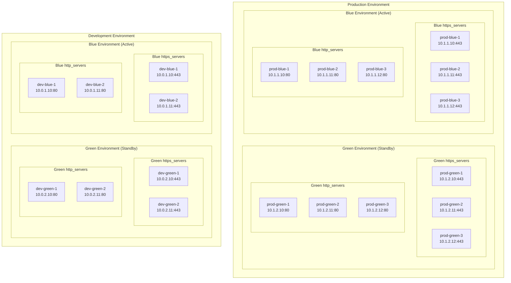

# HAProxy Blue-Green Deployment

This Ansible playbook configures and deploys an HAProxy container for blue-green traffic routing with automatic subdomain rewriting. It supports both Podman/Quadlet and Kubernetes deployments.

## Features

- **Blue-Green Traffic Routing**: Automatic routing between blue and green environments
- **Header Rewriting**: Rewrites generic request subdomains to cluster-specific subdomains
- **Multi-Environment Support**: Supports multiple clusters (dev, prod, etc.)
- **SSL/TLS Support**: Full SSL termination and encryption support
- **Health Monitoring**: Built-in health checks and HAProxy statistics
- **Container Deployment**: Support for both Podman and Kubernetes deployments
- **Switching Script**: Automated blue-green environment switching

## Architecture

The HAProxy load balancer receives requests on standard HTTP/HTTPS ports (80/443) and rewrites the Host header to redirect traffic to the appropriate blue or green environment:

- `dev.example.com` → `dev-blue.example.com` or `dev-green.example.com`
- `dev.example.com` → `deva.example.com` or `devb.example.com`
- `test.example.com` → `test-blue.example.com` or `test-green.example.com`
- `prod.example.com` → `prod-blue.example.com` or `prod-green.example.com`

## Traffic Flow Diagram

```mermaid
graph LR 
    subgraph "Environment"
        subgraph "Green Environment (Standby)"
            subgraph "Green https_servers"
                E1[green<br/>10.0.1.10:443]
            end
            subgraph "Green http_servers"
                E2[green<br/>10.0.1.10:80]
            end
        end
        subgraph "Blue Environment (Active)"
            subgraph "Blue https_servers"
                E3[blue<br/>10.0.1.10:443]
            end
            subgraph "Blue http_servers"
                E4[blue<br/>10.0.1.10:80]
            end
        end
    end

    subgraph "HAProxy Load Balancer" --> E1
        H[HAProxy<br/>Blue-Green Router<br/>:80, :443]
        H --> |"Host Header Rewrite"| HR[Header Rewriter<br/>dev.example.com → dev-blue.example.com<br/>prod.example.com → prod-blue.example.com]
    end
    
    subgraph "Internet/Users" --> H
        U1[User Request<br/>dev.example.com] 
        U2[User Request<br/>prod.example.com]
    end
```


## Quick Start

### Prerequisites

- Ansible 2.9+, community.crypto, community.general, containers.podman, kubernetes.core
- Python 3.6+
- For Podman: Podman 4.0+ with Quadlet support
- For Kubernetes: kubectl configured with cluster access

### Installation

1. **Clone or download the playbook files**
2. **Update variables** in `vars/haproxy-blue-green.yml`
3. **Configure SSL certificates** (if SSL is enabled)
4. **Run the playbook**

## Configuration

### Variables File

Edit `vars/haproxy-blue-green.yml` to configure your environments:

```yaml
# Deployment method: 'podman' or 'kubernetes'
deployment_method: 'kubernetes'

# Blue-Green cluster configurations
blue_green_routing:
  # Default environment to route to (blue or green)
  default_environment: "dev-blue"
  base_subdomain_prefix: "*.apps"
  base_subdomain_suffix: "ocp.cluster.example.com"

  # Cluster subdomain mapping
  cluster_subdomain_mapping:
    source_subdomain: "dev"
    blue_subdomain: "dev-blue"
    green_subdomain: "dev-green"

  # Backend server configurations (these are your vip or LB to the active clusters)
  backends:
    http_servers:
      - name: "dev-blue-1"
        address: "10.0.1.10:80"
        check: "check"
      - name: "dev-blue-2"
        address: "10.0.2.10:80"
        check: "check backup"
    https_servers:
      - name: "dev-blue-1"
        address: "10.0.1.10:443"
        check: "check"
      - name: "dev-blue-2"
        address: "10.0.2.10:443"
        check: "check backup"

```

### SSL Configuration

If SSL is enabled (`haproxy_ssl_enabled: true`), place your SSL certificate and private key in PEM format at the configured path:

```bash
# Create SSL certificate file (certificate + private key)
cat your-cert.crt your-private.key > /etc/ssl/certs/haproxy.pem
chmod 600 /etc/ssl/certs/haproxy.pem
```

## Deployment Methods

### Method 1: Podman Deployment

```bash
# Set deployment method to podman
deployment_method: 'podman'

# Run the playbook
ansible-playbook configure-haproxy-blue-green-deployment.yml --ask-vault-pass -vvv
```

### Method 2: Kubernetes Deployment

```bash
# Set deployment method to kubernetes
deployment_method: 'kubernetes'

# Run the playbook
ansible-playbook configure-haproxy-blue-green-deployment.yml --ask-vault-pass -vvv
```

### Method 3: Standalone Manifests

#### Kubernetes

```bash
# Apply standalone Kubernetes manifests
kubectl apply -f manifests/kubernetes/namespace.yaml
kubectl apply -f manifests/kubernetes/deployment.yaml
kubectl apply -f manifests/kubernetes/service.yaml
```

#### Podman/Quadlet

```bash
# Copy the container file
sudo cp manifests/podman/haproxy-blue-green.container /etc/systemd/system/

# Reload systemd and start
sudo systemctl daemon-reload
sudo systemctl enable --now haproxy-blue-green.service
```

## Blue-Green Switching
 To switch active cluster the best approach is to update variable file and then rerun the playbook to regenerate the haproxy.cfg file to the new configuration.

```bash
# Re-run the playbook to apply changes
ansible-playbook configure-haproxy-blue-green-deployment.yml
```

## Monitoring and Management

### HAProxy Statistics

Access HAProxy statistics at: `http://your-haproxy-host:8404/stats`

- Username: `admin`
- Password: Set in `vault_haproxy_stats_password`

### Health Checks

HAProxy health endpoint: `http://your-haproxy-host:8080/health`

### Service Management

#### Kubernetes

```bash
# Check deployment status
kubectl get pods -n haproxy-blue-green

# View logs
kubectl logs -f deployment/haproxy-blue-green -n haproxy-blue-green

# Scale deployment
kubectl scale deployment/haproxy-blue-green --replicas=3 -n haproxy-blue-green

# Port forward for testing
kubectl port-forward service/haproxy-blue-green-service 8080:80 -n haproxy-blue-green
```

#### Podman

```bash
# Check service status
sudo systemctl status haproxy-blue-green.service

# Start/stop/restart service
sudo systemctl start haproxy-blue-green.service
sudo systemctl stop haproxy-blue-green.service
sudo systemctl restart haproxy-blue-green.service

# View logs
sudo journalctl -u haproxy-blue-green.service -f
```

## File Structure

```
.
├── configure-haproxy-blue-green-deployment.yml  # Main playbook
├── vars/
│   └── haproxy-blue-green.yml                   # Configuration variables
├── tasks/
│   ├── configure-haproxy-blue-green.yml         # HAProxy configuration tasks
│   ├── deploy-haproxy-container.yml             # Podman deployment tasks
│   └── deploy-haproxy-kubernetes.yml            # Kubernetes deployment tasks
├── templates/
│   ├── haproxy-blue-green.cfg.j2                # HAProxy configuration template
│   ├── haproxy-quadlet.container.j2             # Quadlet container template
│   └── haproxy-quadlet.network.j2               # Quadlet network template
└── manifests/
    ├── kubernetes/                              # Standalone Kubernetes manifests
    │   ├── configmap.yaml
    │   ├── namespace.yaml
    │   ├── deployment.yaml
    │   └── service.yaml
    └── podman/                                  # Standalone Podman manifests
        └── haproxy-blue-green.container
        └── haproxy-network.network 
```

## Customization

### Custom HAProxy Configuration

Modify the HAProxy template (`templates/haproxy.cfg.j2`) to add custom:
- Load balancing algorithms
- Health check configurations
- SSL/TLS settings
- ACL rules
- Custom headers

### Resource Limits

Adjust resource limits in the variables file:

```yaml
# Kubernetes resource limits
kubernetes_resources:
  requests:
    memory: "512Mi"
    cpu: "500m"
  limits:
    memory: "1Gi"
    cpu: "1000m"

# Podman resource limits
podman_memory_limit: "1g"
podman_cpu_shares: 2048
```

## Troubleshooting

### Common Issues

1. **SSL Certificate Issues**
   - Verify certificate format (PEM with cert + key)
   - Check file permissions (600)
   - Validate certificate expiration

2. **Backend Server Connectivity**
   - Verify backend server addresses and ports
   - Check firewall rules
   - Test health check endpoints

3. **DNS Resolution**
   - Ensure subdomains resolve correctly
   - Check DNS configuration
   - Verify internal vs external DNS

### Debugging

1. **Check HAProxy Configuration**
   ```bash
   # Validate configuration
   haproxy -f /etc/haproxy/haproxy.cfg -c
   ```

2. **Monitor HAProxy Logs**
   ```bash
   # Kubernetes
   kubectl logs -f deployment/haproxy-blue-green -n haproxy-blue-green
   
   # Podman
   sudo journalctl -u haproxy-blue-green.service -f
   ```

3. **Test Connectivity**
   ```bash
   # Test health endpoint
   curl -v http://localhost:8080/health
   
   # Test routing with specific Host header
   curl -H "Host: dev.example.com" http://localhost/
   ```

## Security Considerations

- Use strong passwords for HAProxy stats
- Implement proper SSL/TLS configuration
- Restrict network access using firewalls
- Keep HAProxy and container images updated
- Use secrets management for sensitive data
- Enable audit logging

## Support

For issues and questions:
1. Check the troubleshooting section
2. Review HAProxy logs and statistics
3. Validate configuration files
4. Test network connectivity

## License

This playbook is provided as-is for educational and operational use. 
