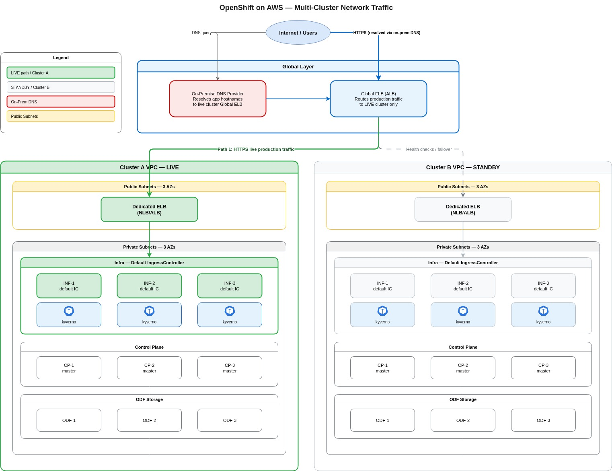
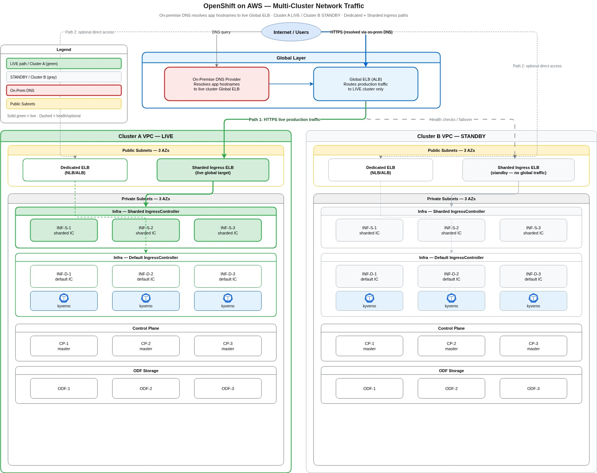

# AWS Mutli Clusters behind a live Load Balancer 

To increase platform resiliency and accelerate our response to unpredictable events or disasters, we are adopting a Blue-Green deployment architecture for our clusters.

This approach allows us to react rapidly to issues like API server failures or data spillage by quickly spinning up a standby replacement cluster. Additionally, it improves our upgrade path: instead of performing in-place upgrades, we can stand up a brand-new cluster at the target version and safely migrate tenant workloads without impacting end users.

To implement this, every future cluster will leverage three DNS records, which will also be reflected in each cluster's PKI certificate.

Currently, deploying a cluster requires requesting api.cluster.domain and apps.cluster.domain. The downside is that if a cluster is impaired, we must tear down and reprovision it to reuse the same DNS records and PKI certificates.

Under the new Blue-Green approach, every cluster will use three domain pairs to support an active (hot) cluster and a standby (warm) cluster. Specifically, we will request:

api.cluster.domain / apps.cluster.domain (Live Routing)

api.clustera.domain / apps.clustera.domain (Green Cluster)

api.clusterb.domain / apps.clusterb.domain (Blue Cluster)

While the Blue and Green pairs will target their respective physical clusters, the Live pair will target a routing AWS Elastic Load Balancer (ELB) that dynamically directs production traffic to the active environment.

**The Solution (Blue-Green Architecture):**

## The Design 

### The Current Design:
Currently, each OpenShift cluster is deployed with its own set of dedicated AWS Elastic Load Balancers (ELBs) that directly handle traffic for the cluster's specific domains (api.cluster.domain and apps.cluster.domain).

### The Blue-Green Design:
Transitioning this model to a Blue-Green architecture means a single logical cluster environment will now have two distinct sets of dedicated ELBs—one for the Active (Green) cluster and one for the Standby (Blue) cluster.

### Introducing the Routing Layer:
To ensure this backend transition is completely transparent to end users and application consumers, we are introducing a primary routing ELB. This routing ELB will manage traffic for all external-facing routes, while the underlying dedicated ELBs will continue to manage traffic bound specifically for their respective physical clusters.

Therefore, the external routing ELB will act as a dynamic switch. Instead of routing traffic directly to a static cluster, it will point to the dedicated ELB of whichever cluster (Blue or Green) is currently designated as active, allowing us to perform seamless failovers and upgrades without any DNS propagation delays or user-facing disruptions.

Therefore going forward, every cluster deployment will leverage three DNS records (which will also be reflected in the PKI certificates):

Live Routing Pair: api.cluster.domain and apps.cluster.domain

Active (Green) Pair: api.clustera.domain and apps.clustera.domain

Standby (Blue) Pair: api.clusterb.domain and apps.clusterb.domain

**How Traffic Flow Works:**
Each environment pair (Blue and Green) will host an independent cluster associated with its own AWS Elastic Load Balancer (ELB). The live DNS records will point to a primary "routing" ELB. This routing ELB will not host a cluster itself; instead, it will dynamically direct incoming traffic to whichever cluster is designated as active (hot), keeping the other on standby (warm) for instant failover or upgrades.

## Architecture Diagram

The Routing Layer (New): A primary, external-facing ELB that hosts public application routes. This layer does not run workloads; it simply points to the active cluster.

The Cluster Layer (Existing): Two separate sets of dedicated ELBs that point directly to the physical Blue and Green OpenShift clusters.

Therefore, when we need to failover or run an upgrade, we only have to update the target of the Routing ELB to point from Blue to Green. The end user's connection remains uninterrupted because their client always talks to the same external ELB.
